# Total Energy Cost Calculator — Scope & Estimate

**Date:** 14 April 2026
**Status:** Draft for stakeholder review
**Target:** Public-facing application on `genesisenergy.co.nz`

---

## 1. Executive Summary

Genesis Energy currently offers the Cogo "Go Electric" calculator — a white-label electrification tool that recommends upgrade purchases (heat pumps, solar, EVs) and connects households to installers. ASB launched the identical Cogo platform a month earlier with better financing ($80k at 1% interest). Genesis has no differentiation.

The **Total Energy Cost Calculator** is a Genesis-owned tool that answers a different question: _"What is energy actually costing my household — and how much could I save by going electric?"_ It calculates total household energy spend across electricity, gas, and petrol, models the savings of full electrification, and provides an AI-powered energy advisor for personalised guidance.

This is not a Cogo replacement. It is the **awareness and education layer** that sits in front of Cogo. The TCE Calculator shows the problem; Cogo's installer marketplace provides the solution. Together they form a complete customer journey that no competitor can replicate.

### What Exists Today (POC)

A working prototype with:
- Full TCE calculation engine (client-side, no backend dependency)
- AI Energy Advisor (Claude-powered, streaming, grounded in user's data)
- Stacked bar chart comparing current vs electrified costs
- Prioritised electrification roadmap with upfront costs and payback periods
- Emissions comparison (current vs electrified CO2)
- Household cost dashboard across 8 spending categories
- 40+ savings ideas across 11 lifestyle categories
- Receipt scanner (Claude Vision OCR)
- Genesis Brand 4.0 design tokens throughout
- 3 demo household profiles

### What's Needed for Production

The POC calculation logic is sound. The gaps are operational — security, compliance, real data sources, accessibility, and the Cogo handoff.

Everything below is what's required to get there.

---

## 2. What We Need

This section is the complete list of things Genesis needs to provide, decide, or approve. Development work cannot fully proceed without these. Items are grouped by urgency.

### Decisions Required

These are open questions that affect scope. They don't need answers today, but they need answers before the relevant phase starts.

| # | Decision | Options | Impact | Needed By |
|---|----------|---------|--------|-----------|
| D1 | **Where do we host this?** | Vercel Pro _or_ Azure App Service | Affects deployment pipeline, domain setup, and cost. Vercel is fastest to ship; Azure may be required by Genesis IT policy. | Phase 1 start |
| D2 | **What domain?** | `calculator.genesisenergy.co.nz` / `energy.genesisenergy.co.nz` / other | Needs DNS entry + SSL certificate from Genesis IT. | Phase 1 start |
| D3 | **How do we keep energy pricing current?** | Manual quarterly JSON update _or_ live API from EMI/Electricity Authority | Manual is zero-dependency and works now. Live API is better but may not exist. | Phase 2 start |
| D4 | **Do we surface Genesis plans in the results?** | Yes (specific plan cards + pricing) _or_ No (generic "contact Genesis" CTAs) | If yes, need plan details from product/marketing team. If no, simpler build. | Phase 2 start |
| D5 | **Does the TCE Calculator sit alongside Cogo or eventually replace it?** | Complement (recommended) _or_ Replace | Affects whether we build installer connections or just link out to Cogo. Recommend complement — Cogo handles the purchase journey, we handle awareness. | Before launch |

### Approvals Required

These are sign-offs from Genesis teams. Each one is a gate — we can build in staging without them, but cannot go live.

| # | Approval | Who | What They Need to See | Lead Time |
|---|----------|-----|----------------------|-----------|
| A1 | **Stakeholder green light** | Stephen England-Hall, Ed Hyde | POC demo — already built and ready to show | 1 meeting |
| A2 | **Brand sign-off** | Genesis Brand / Design team | Review the app against Brand 4.0 guidelines. POC already uses the correct tokens (Ultra Orange, Ultra Violet, Space, Sunwash Yellow). | 1 week |
| A3 | **Legal review** | Genesis Legal | Draft privacy policy, terms of use, AI disclaimer, savings estimate disclaimer. We write the drafts, legal approves/amends. | 1–2 weeks |
| A4 | **IT / Security review** | Genesis IT / InfoSec | Security review of the application before it goes on a genesisenergy.co.nz subdomain. Scope: API security, dependency audit, CSP headers, no exposed secrets. | 1–2 weeks |

### Accounts & Access Required

These are service accounts or API keys that engineering needs to build and deploy.

| # | What | Who Sets It Up | What We Need | Lead Time | Fallback If Delayed |
|---|------|---------------|-------------|-----------|-------------------|
| S1 | **Anthropic API account** | Genesis IT or Engineering | Production API key for Claude Sonnet 4. Billing set up. Key stored as environment variable (server-side only). | 1–2 days | POC demo mode works without it (keyword-matched responses) |
| S2 | **Hosting account** | Genesis IT | Vercel Pro team _or_ Azure App Service instance. CI/CD pipeline from GitHub. | 1–2 weeks | Deploy to Vercel free tier for staging/UAT |
| S3 | **DNS entry** | Genesis IT / Network | CNAME or A record for chosen subdomain → hosting provider | 1 week | Use Vercel default URL for UAT |
| S4 | **NZTA Vehicle Register API** | Engineering (register with Waka Kotahi) | API access for vehicle rego lookup — fuel type, make, model | 1–3 weeks | Manual vehicle type selection (already works in POC) |
| S5 | **Google Maps API key** (optional) | Genesis IT / Google Cloud | Places Autocomplete API enabled, restricted to Genesis domains | 2–3 days | Manual region dropdown (already works in POC) |
| S6 | **Email service account** (optional) | Genesis IT / Marketing | SendGrid or Resend for transactional "send me my results" emails | 3–5 days | No email capture at launch, add later |
| S7 | **Analytics property** | Genesis Marketing / Digital | GA4 property or Mixpanel project for the calculator subdomain | 1–2 days | No analytics at launch (not recommended) |

### Data & Content Required

These are inputs from Genesis teams that feed into the calculator or the pages around it.

| # | What | Who Provides | Format | Needed By | Fallback If Delayed |
|---|------|-------------|--------|-----------|-------------------|
| C1 | **Genesis plan details** | Product / Marketing | Plan names, key features, indicative pricing, eligibility (e.g. "EnergyEV plan is for households with an EV") | Phase 2 | Generic "explore Genesis plans" link |
| C2 | **Power Circle offers** | Marketing | Current offers relevant to electrification (heat pump deals, EV charging, solar) | Phase 2 | Omit offers section, add later |
| C3 | **Privacy policy copy** | Legal (we draft, they approve) | Markdown or plain text | Phase 1 (before go-live) | Draft copy on staging |
| C4 | **Terms of use copy** | Legal (we draft, they approve) | Markdown or plain text | Phase 1 (before go-live) | Draft copy on staging |
| C5 | **Cogo deep-link URLs** | Cogo Account Manager | Confirm the correct URLs for heating, solar, and vehicle flows. Confirm whether URL parameters are supported for pre-filling user data. | Phase 1 | Use known public URLs with standard UTM params |

### Summary: Critical Path

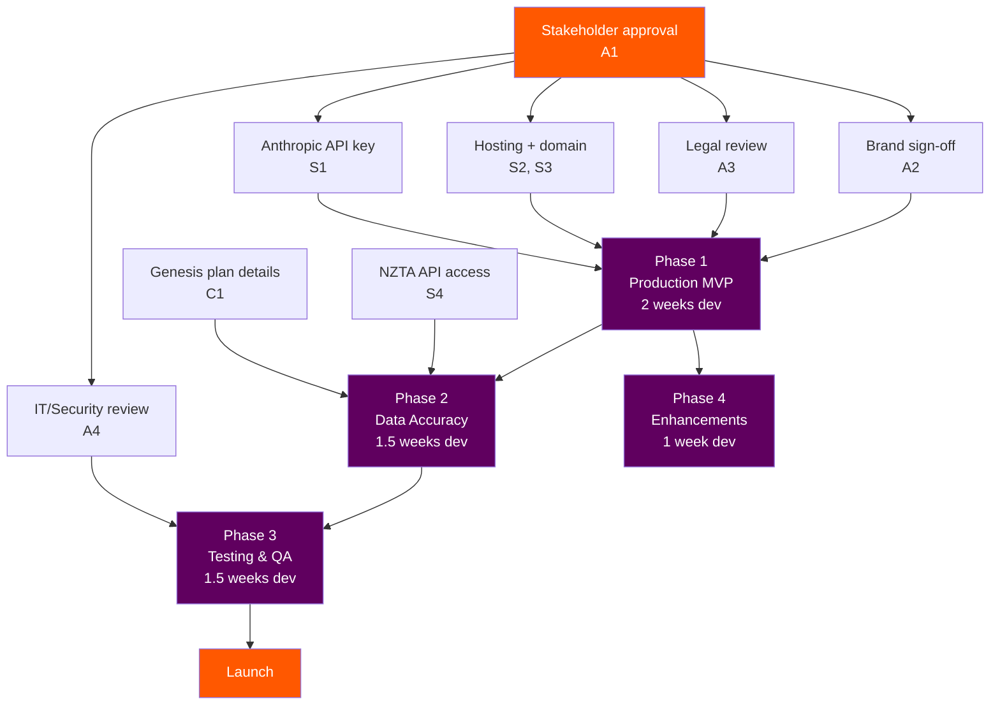

> **The single biggest blocker is stakeholder approval (A1).** Everything else can be kicked off in parallel once that's given. The longest lead-time items after that are Genesis IT (hosting, domain, security review) and NZTA API access — neither blocks Phase 1 development, but both need to start early.

---

## 3. System Architecture

> _Sections 3–8 below are technical detail. If you're a stakeholder reviewing this document, section 2 above is the key section for you._

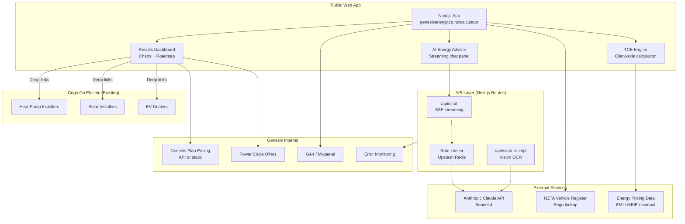

---

## 4. User Journey

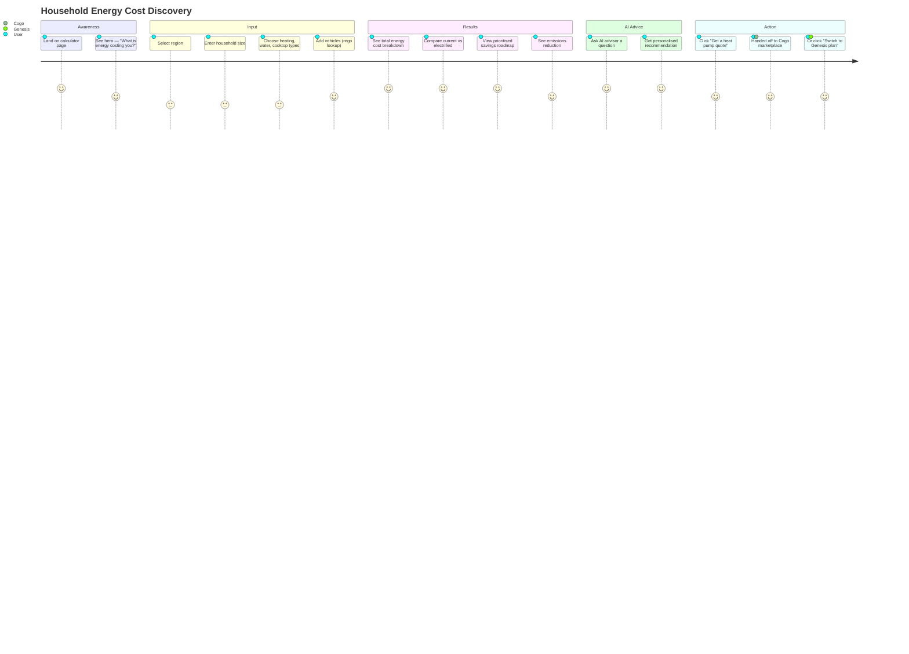

---

## 5. Cogo Integration

### Strategic Position

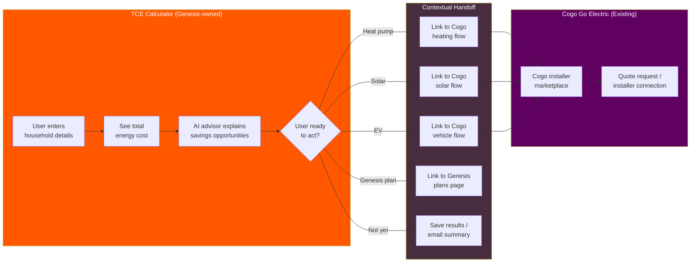

### How It Works

The TCE Calculator generates a prioritised electrification roadmap (e.g. "Switch heating to heat pump — saves $620/yr, payback in 3.2 years"). Each roadmap item gets a "Take action" link that deep-links to the corresponding Cogo Go Electric flow at `goelectric.genesisenergy.co.nz`.

No API integration is required. The handoff is contextual URLs based on the user's results. If Cogo later supports URL parameters for pre-filling user data (region, property type), the handoff becomes seamless — this should be investigated with the Cogo account manager.

### Ownership Split

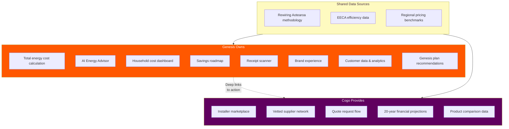

---

## 6. Data Flow

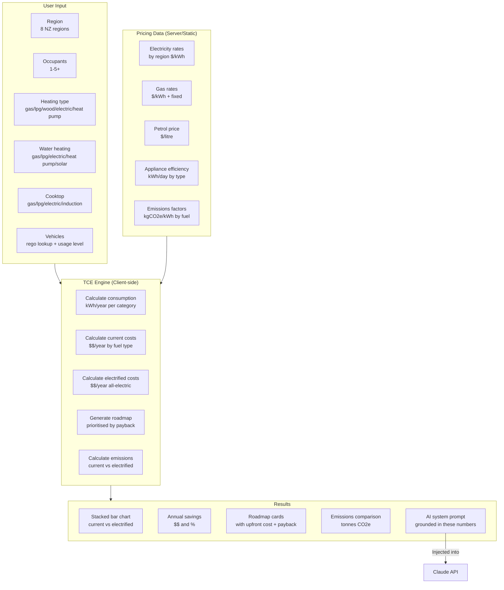

---

## 7. Detailed Scope — Phase 1: Production MVP

**Goal:** Take the working POC and make it safe, compliant, and resilient enough to put on a public Genesis URL.

**Elapsed time:** 2 weeks (1 developer)

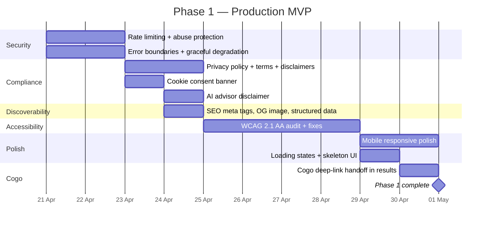

### 1.1 Rate Limiting & Abuse Protection
**Estimate:** 2 days | **Priority:** Must have

The `/api/chat` and `/api/scan-receipt` endpoints call the Anthropic Claude API. On a public-facing site, bots and bad actors can run up costs quickly. This work adds per-IP request throttling to all API routes.

**What gets built:**
- Upstash Redis (or Vercel KV) integration for request counting
- Per-IP rate limits: 20 chat messages per hour, 10 receipt scans per hour
- Sliding window algorithm (not fixed window) to prevent burst abuse
- HTTP 429 response with `Retry-After` header when limit hit
- Client-side UI feedback when rate limited ("You've asked a lot of questions — try again in a few minutes")
- Optional: session-based caps (e.g. max 50 messages per calculator session)

**Acceptance criteria:**
- A single IP cannot exceed 20 chat requests/hour
- Rate-limited users see a friendly message, not a raw error
- Legitimate usage patterns (fill form, ask 3-5 questions) are never throttled
- Redis connection failure degrades gracefully (allow requests through, log error)

---

### 1.2 Error Boundaries & Graceful Degradation
**Estimate:** 2 days | **Priority:** Must have

The POC assumes everything works. Production needs to handle: Claude API down, slow responses, malformed input, network failures, and JavaScript errors that crash the React tree.

**What gets built:**
- React Error Boundary wrapping the calculator, results, and AI panel independently — one section crashing doesn't take down the whole page
- Claude API timeout handling (30s timeout, retry once, then show fallback message)
- Fallback states: if Claude API is unavailable, the calculator and results still work (they're client-side). Only the AI advisor degrades — show "AI advisor is temporarily unavailable" with conversation starters as static FAQ links
- Network error detection and user-friendly messaging
- Input validation hardening (Zod schemas already exist but need edge-case review)

**Acceptance criteria:**
- Claude API outage does not affect calculator or results
- AI panel shows a clear fallback state when Claude is unavailable
- No unhandled React crashes reach the user (white screen of death)
- All API errors return structured JSON with user-friendly messages

---

### 1.3 Privacy Policy, Terms of Use & Disclaimers
**Estimate:** 2 days | **Priority:** Must have (legal blocker)

A public-facing Genesis tool needs legal pages. The calculator makes savings estimates that could be challenged — strong disclaimers are essential.

**What gets built:**
- `/privacy` page — what data is collected (analytics cookies, AI conversation content sent to Anthropic, no PII stored), data retention policy, NZ Privacy Act 2020 compliance statement
- `/terms` page — savings estimates are indicative only, based on publicly available data, not a guarantee. Genesis is not providing financial advice. Methodology references (Rewiring Aotearoa, EECA, Powerswitch)
- Inline disclaimer banner on results page: "These estimates are based on average usage patterns and publicly available pricing data. Your actual savings will depend on your specific circumstances."
- AI advisor disclaimer: "This is an AI assistant. Responses are generated by AI and may not be perfectly accurate. For specific advice about your energy plan, contact Genesis directly."
- Footer links to privacy policy and terms on every page

**Acceptance criteria:**
- Genesis legal team has reviewed and approved all copy
- Privacy policy accurately reflects data handling (no PII stored, analytics disclosure, Anthropic API disclosure)
- Disclaimers are visible before users act on savings estimates
- AI advisor is clearly identified as AI-generated content

**Dependency:** Legal copy needs Genesis legal review — engineering builds the pages, legal provides/approves the content.

---

### 1.4 Cookie Consent Banner
**Estimate:** 1 day | **Priority:** Must have (legal requirement)

Required under NZ Privacy Act 2020 if using analytics (GA4, Mixpanel) or any third-party scripts that set cookies.

**What gets built:**
- Cookie consent banner component (bottom of viewport, non-blocking)
- Three options: Accept all, Reject non-essential, Manage preferences
- Analytics scripts (GA4) only load after consent is granted
- Consent preference stored in localStorage (no server-side tracking before consent)
- Preference persists across sessions, with option to change in footer

**Acceptance criteria:**
- No analytics cookies set before user consents
- Banner appears on first visit, does not reappear after choice is made
- "Reject" disables all non-essential tracking
- Compliant with NZ Privacy Act 2020 requirements

---

### 1.5 AI Advisor Disclaimer
**Estimate:** 0.5 days | **Priority:** Must have

Separate from the general terms — this is an inline, always-visible disclosure that the chat panel is AI-powered.

**What gets built:**
- Persistent label at the top of the conversation panel: "AI Energy Advisor — powered by AI. Responses are generated and may not be perfectly accurate."
- First message from the advisor includes a brief context-setting note
- If the user asks about specific Genesis plans or pricing, the AI directs them to contact Genesis or visit the plans page rather than inventing plan details

**Acceptance criteria:**
- Users cannot interact with the AI advisor without seeing the AI disclosure
- AI does not fabricate Genesis plan names, prices, or terms

---

### 1.6 SEO — Meta Tags, OG Image, Structured Data
**Estimate:** 1 day | **Priority:** Should have

If this lives on a Genesis subdomain, it should be discoverable and shareable. A shared link on Facebook/LinkedIn should show a compelling preview.

**What gets built:**
- Page title, meta description, and canonical URL optimised for "energy cost calculator NZ"
- Open Graph tags (og:title, og:description, og:image) with a branded preview card
- Twitter Card meta tags
- JSON-LD structured data (WebApplication schema)
- Favicon and apple-touch-icon using Genesis brand assets
- `robots.txt` and basic `sitemap.xml`

**Acceptance criteria:**
- Sharing the URL on social media shows a Genesis-branded preview card with title, description, and image
- Page appears in Google search results within 2 weeks of indexing
- Lighthouse SEO score 90+

---

### 1.7 WCAG 2.1 AA Accessibility Audit & Fixes
**Estimate:** 4 days | **Priority:** Must have

A public-facing tool for a major NZ energy company must be accessible. This is both a legal risk (NZ Human Rights Act) and a brand risk.

**What gets built:**
- Full accessibility audit using axe-core, Lighthouse, and manual keyboard/screen reader testing
- Fix all Level A and AA violations:
  - Keyboard navigation: all interactive elements reachable via Tab, operable via Enter/Space
  - Focus management: visible focus indicators on all interactive elements, focus trapped in modals (AI panel, receipt scanner)
  - Screen reader: all images have alt text, charts have text alternatives or aria-labels, form fields have associated labels, error messages are announced
  - Colour contrast: all text meets 4.5:1 ratio (body) and 3:1 ratio (large text) — verify against Genesis brand colours
  - Motion: respect `prefers-reduced-motion` for chart animations and streaming text
  - Forms: clear error messages associated with fields, required fields indicated
- Skip-to-content link
- Landmark regions (`main`, `nav`, `complementary` for AI panel)

**Acceptance criteria:**
- Zero axe-core violations at AA level
- Full calculator flow completable via keyboard only
- Screen reader (VoiceOver on macOS) can navigate and understand all content
- Lighthouse Accessibility score 95+
- Chart data accessible as text alternative (not just visual)

---

### 1.8 Mobile Responsive Polish
**Estimate:** 2 days | **Priority:** Should have

The POC is responsive but hasn't been tested across devices. Public launch means it needs to work on the phones NZ households actually use.

**What gets built:**
- Test and fix layout on: iPhone SE (small), iPhone 15 (medium), Samsung Galaxy S24 (Android), iPad Mini (tablet)
- Touch target sizing: all buttons and interactive elements minimum 44x44px
- Form input sizing: no zoom-on-focus on iOS (font-size >= 16px on inputs)
- Chart responsiveness: stacked bar chart readable on 320px viewport
- AI conversation panel: full-screen sheet on mobile (already a Sheet component, verify behaviour)
- Horizontal scroll prevention on all viewports
- Safe area insets for notched devices

**Acceptance criteria:**
- No horizontal overflow on any viewport 320px+
- All touch targets meet 44x44px minimum
- Charts are readable and interactive on mobile
- Forms don't trigger iOS zoom
- AI panel is usable as full-screen overlay on mobile

---

### 1.9 Loading States & Skeleton UI
**Estimate:** 1 day | **Priority:** Should have

The calculator results render instantly (client-side), but the AI advisor streams and the receipt scanner processes. Users need visual feedback.

**What gets built:**
- Skeleton loading state for the results section while calculation runs (near-instant, but prevents layout shift)
- Typing indicator in the AI panel while waiting for Claude's first token
- Progress indicator on receipt scanner (uploading → processing → done)
- Smooth scroll to results section after form submission

**Acceptance criteria:**
- No layout shift when results appear
- AI panel shows typing indicator within 200ms of sending a message
- Receipt scanner shows clear progress through upload → scan → result stages

---

### 1.10 Cogo Deep-Link Handoff
**Estimate:** 1 day | **Priority:** Should have

The connection between the TCE Calculator and Cogo's Go Electric marketplace. Each roadmap recommendation links to the relevant Cogo flow.

**What gets built:**
- "Take action" CTA on each roadmap card that links to the appropriate Cogo page:
  - Heating → `goelectric.genesisenergy.co.nz/welcome/property` (heating flow)
  - Solar → `goelectric.genesisenergy.co.nz/welcome/property` (solar flow)
  - EV → `goelectric.genesisenergy.co.nz/welcome/vehicle` (vehicle flow)
- Links open in new tab with `rel="noopener"` and UTM parameters for tracking (`utm_source=tce-calculator&utm_medium=roadmap&utm_content=heat-pump`)
- "Ready to make the switch?" summary section at bottom of results with all applicable Cogo links
- Link to Genesis plans page for plan-switching recommendations

**Acceptance criteria:**
- Each roadmap item has a clear action CTA
- Links go to the correct Cogo flow based on recommendation type
- UTM parameters allow Genesis to track TCE Calculator → Cogo conversion in analytics
- Links work and are not broken (validated manually)

---

## 8. Detailed Scope — Phase 2: Data Accuracy

**Goal:** Replace hardcoded POC data with real, maintainable data sources so the calculator produces trustworthy numbers.

**Elapsed time:** 1.5 weeks (1 developer)

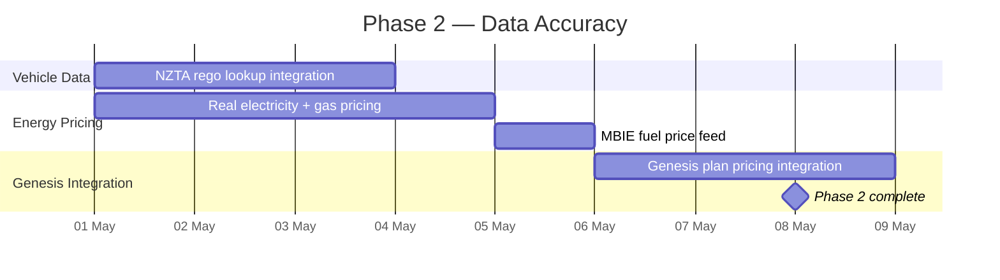

### 2.1 NZTA Vehicle Register — Real Rego Lookup
**Estimate:** 3 days | **Priority:** Must have

The POC mocks rego lookup with hardcoded responses. A public calculator needs to resolve real NZ plates to vehicle type, fuel type, and approximate fuel economy.

**What gets built:**
- Server-side API route `/api/vehicle-lookup` that queries the NZTA Motor Vehicle Register
- Extract: make, model, year, fuel type (petrol/diesel/electric/hybrid/PHEV), engine capacity
- Map fuel type to TCE engine input format
- Estimate fuel economy from engine capacity + vehicle class (using EECA/RightCar data as lookup table where NZTA doesn't provide it directly)
- Graceful fallback: if rego not found or API unavailable, user can manually select vehicle type and usage level (existing POC flow)
- Rate limit outbound NZTA requests (respect their terms of use)
- Cache successful lookups for 24 hours (vehicle data doesn't change often)

**Acceptance criteria:**
- Entering a valid NZ plate returns correct vehicle fuel type
- Invalid/not-found plates fall back to manual selection with no error
- NZTA API being slow (>5s) or down doesn't block the form
- Cached lookups return instantly on repeat queries

**Dependency:** May need registration/approval for NZTA API access. Investigate API terms early.

---

### 2.2 Real Electricity & Gas Pricing
**Estimate:** 4 days | **Priority:** Must have

The POC uses hardcoded rates from Powerswitch 2025 and MBIE March 2026. A production tool needs a maintainable way to keep pricing current.

**What gets built:**
- **Option A (preferred):** Server-side pricing module that reads from a JSON config file (`/data/energy-pricing.json`) with rates by region and fuel type. Updated manually each quarter from Powerswitch/EMI published data. Includes a `lastUpdated` timestamp shown to users ("Pricing data as of Q2 2026").
- **Option B (if API available):** Integration with EMI (Electricity Market Information) data feed for real-time regional pricing. This is the ideal state but EMI may not offer a clean API — needs investigation.
- Pricing config includes: electricity $/kWh by region, gas $/kWh + fixed annual charge, LPG $/kWh, daily fixed charges by region
- Admin-friendly format: a non-developer at Genesis could update the JSON with new quarterly figures
- "Pricing data last updated" indicator visible on results page
- Methodology note explaining data sources

**Acceptance criteria:**
- Pricing can be updated by editing a single JSON file (no code changes required)
- Results page shows when pricing data was last updated
- Regional pricing differences are reflected accurately (e.g. Wellington cheaper than Northland)
- Methodology section cites data sources

**Dependency:** If Genesis wants live pricing, need to investigate EMI/Electricity Authority data access. Manual quarterly update is the safe fallback.

---

### 2.3 MBIE Fuel Price Feed
**Estimate:** 1 day | **Priority:** Should have

Petrol and diesel prices are hardcoded at $3.20/L. MBIE publishes weekly fuel price monitoring data.

**What gets built:**
- Fuel pricing pulled from the same `energy-pricing.json` config as electricity/gas
- Fields: petrol $/litre (regular), diesel $/litre, by region if available (MBIE publishes regional data)
- Update frequency: weekly or fortnightly (MBIE publishes every Monday)
- Fallback: if not updated, use last known price with "(as of [date])" indicator

**Acceptance criteria:**
- Fuel prices are not older than 4 weeks at any given time
- Regional fuel price differences reflected if data available
- Source and date visible to users

---

### 2.4 Genesis Plan Pricing Integration
**Estimate:** 3 days | **Priority:** Should have

The calculator currently gives generic advice. If it can reference actual Genesis plans, it becomes a sales tool — "You could save $X by switching to Genesis FreeHours" or "Genesis EnergyEV plan saves $Y on overnight EV charging."

**What gets built:**
- **Option A (minimal):** Static content cards in the results section promoting relevant Genesis plans based on the user's profile. E.g., if user has an EV → show EnergyEV plan card. If user has high night usage → show FreeHours card. Content managed via JSON config.
- **Option B (if API available):** Integration with Genesis pricing API to show actual plan costs based on estimated consumption. This lets the calculator say "On the Genesis FreeHours plan, your estimated annual electricity cost would be $X."
- AI advisor system prompt updated to reference available Genesis plans (names and high-level benefits only — not fabricated pricing)

**Acceptance criteria:**
- Relevant Genesis plans are surfaced based on the user's energy profile
- Plan information is accurate and maintained (static content reviewed quarterly, or API-fed)
- AI advisor references real Genesis plans by name without fabricating pricing details
- Clear CTAs to Genesis plans page or sign-up flow

**Dependency:** Genesis product/marketing team needs to provide plan details, pricing, and eligibility rules. If an internal API exists, engineering team needs access.

---

## 9. Detailed Scope — Phase 3: Testing & QA

**Goal:** Verify the calculator produces correct results, works across browsers, performs well, and is secure enough for a public Genesis URL.

**Elapsed time:** 1.5 weeks (1 developer)

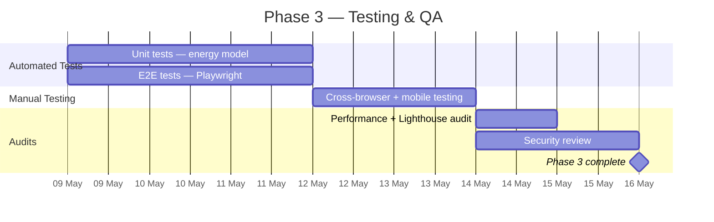

### 3.1 Unit Tests — Energy Model
**Estimate:** 3 days | **Priority:** Must have

The TCE engine is the core of the product. If the calculations are wrong, the tool is worse than useless — it actively misleads people. Unit tests validate every calculation path.

**What gets built:**
- Test suite covering `calculateTCE()` and all sub-functions:
  - `calculateTotalConsumption()` — verify kWh/year for each appliance type, occupancy multiplier, regional multiplier
  - `calculateCurrentCosts()` — verify cost breakdown for each fuel type combination
  - `calculateElectrifiedCosts()` — verify all-electric costs with correct efficiency factors
  - `generateRoadmap()` — verify payback calculations, priority ordering, edge cases (already electric = no recommendation)
  - `calculateEmissions()` — verify CO2 calculations against known factors
- Test each of the 3 demo profiles and verify outputs match expected values
- Edge cases: 1 occupant, 5+ occupants, no vehicles, all-electric household (savings should be minimal), all-gas household (savings should be maximal)
- Regression guard: if pricing constants are updated, tests flag any unexpected output changes

**Acceptance criteria:**
- 100% function coverage on `lib/energy-model/`
- All 3 demo profiles produce results within 5% of manually calculated expected values
- Edge cases handled without errors or NaN outputs
- Tests run in CI on every commit

---

### 3.2 E2E Tests — Playwright
**Estimate:** 3 days | **Priority:** Must have

Automated browser tests that verify the full user journey works end-to-end.

**What gets built:**
- Happy path: fill form → see results → open AI advisor → send message → see streaming response → click Cogo link
- Demo profile quick-fill: click each demo household → verify results render
- Form validation: submit with missing fields → see error messages
- Mobile viewport: run happy path at 375px width
- AI advisor: verify fallback state when Claude API is mocked as unavailable
- Receipt scanner: upload test image → verify processing flow
- Rate limiting: verify 429 response shown gracefully after exceeding limits (mocked)
- Accessibility: automated axe-core checks on key pages

**Acceptance criteria:**
- All E2E tests pass in CI (GitHub Actions)
- Tests run against both desktop (1280px) and mobile (375px) viewports
- Tests complete in under 2 minutes
- Flaky test rate < 5%

---

### 3.3 Cross-Browser & Mobile Testing
**Estimate:** 2 days | **Priority:** Should have

Manual testing on real devices and browsers that NZ households actually use.

**What gets tested:**
- **Desktop:** Chrome (latest), Safari (latest, macOS), Firefox (latest), Edge (latest)
- **Mobile:** Safari on iOS 17+ (iPhone), Chrome on Android 14+ (Samsung Galaxy)
- **Tablet:** Safari on iPadOS
- **Key flows per browser:** form fill, results render, chart interaction, AI panel open/close, receipt upload, Cogo link navigation
- **Specific checks:** chart rendering (Recharts can behave differently across browsers), streaming text display, touch interactions, safe area insets

**Acceptance criteria:**
- No broken layouts or missing functionality on any tested browser
- Charts render correctly on all platforms
- AI streaming text displays correctly (no flickering, no missing characters)
- All issues logged and fixed before launch

---

### 3.4 Performance & Lighthouse Audit
**Estimate:** 1 day | **Priority:** Should have

A slow calculator loses users. Verify Core Web Vitals and optimise any bottlenecks.

**What gets tested:**
- Lighthouse audit on desktop and mobile
- Core Web Vitals: LCP < 2.5s, FID < 100ms, CLS < 0.1
- Bundle size analysis (Next.js bundle analyser) — Recharts is the largest dependency, verify tree-shaking
- Image optimisation (OG image, any brand assets)
- Font loading strategy (Geist font — verify swap/fallback behaviour)
- SSE streaming performance under load (concurrent connections)

**Acceptance criteria:**
- Lighthouse Performance score 90+ (desktop), 80+ (mobile)
- LCP < 2.5s on 4G network simulation
- No render-blocking resources
- Total JS bundle < 300KB gzipped

---

### 3.5 Security Review
**Estimate:** 2 days | **Priority:** Must have

A public-facing application on a Genesis domain needs a security review before launch.

**What gets reviewed:**
- API routes: input validation, output sanitisation, no injection vectors
- Rate limiting effectiveness (verify can't be bypassed via headers or IP spoofing)
- CORS configuration (restrict to Genesis domains only)
- Content Security Policy headers
- No API keys or secrets exposed in client-side code (verify ANTHROPIC_API_KEY is server-side only)
- Dependency audit (`npm audit`) — fix any high/critical vulnerabilities
- HTTP security headers: HSTS, X-Content-Type-Options, X-Frame-Options, Referrer-Policy
- AI prompt injection review: verify user input to the AI advisor can't manipulate the system prompt in harmful ways

**Acceptance criteria:**
- Zero high/critical vulnerabilities in `npm audit`
- All OWASP top 10 vectors reviewed and mitigated
- CSP headers configured and tested
- Pen test or security review sign-off from Genesis IT (if required)

---

## 10. Detailed Scope — Phase 4: Enhancements

**Goal:** Add features that increase engagement, capture leads, and provide Genesis with usage insights. Not required for launch but adds significant value.

**Elapsed time:** 1 week (1 developer)

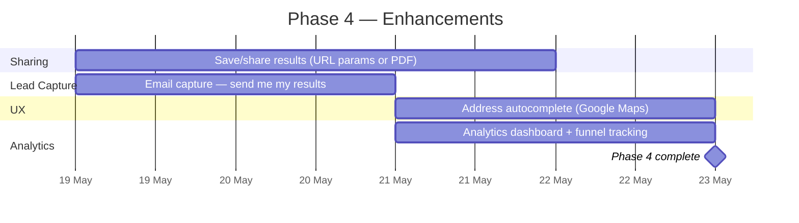

### 4.1 Save & Share Results
**Estimate:** 3 days | **Priority:** Should have

Users want to share their results with partners/family or return to them later. This also creates organic social distribution.

**What gets built:**
- **URL-based sharing:** Encode form inputs as URL query parameters (region, occupants, heating type, etc.). Loading the URL re-runs the calculation and shows results — no server storage needed. Short enough for messaging apps.
- **PDF export:** Generate a branded one-page PDF summary: household profile, cost comparison chart, savings amount, roadmap highlights, Cogo action links. Uses the existing `html-to-image` library to capture the results section + a Genesis-branded PDF template.
- **Social sharing buttons:** Copy link, share to Facebook, share to LinkedIn — with OG tags so the preview card looks good.

**Acceptance criteria:**
- Shared URL reproduces the exact same results when opened
- PDF is Genesis-branded and contains all key outputs
- Social sharing shows a compelling preview card
- URL parameters don't leak sensitive data (no PII — only energy profile choices)

---

### 4.2 Email Capture — "Send Me My Results"
**Estimate:** 2 days | **Priority:** Should have (lead gen)

Capture email addresses from engaged users. This is the highest-intent lead Genesis can get — someone who has already calculated their savings.

**What gets built:**
- "Email me my results" CTA on the results page
- Simple form: email address + optional name
- Server-side API route `/api/send-results` that sends a branded email with: results summary, savings amount, roadmap highlights, Cogo action links, Genesis plan suggestions
- Email service: Resend or SendGrid (simple transactional email)
- Email stored for Genesis CRM/marketing (with consent checkbox and privacy disclosure)
- Double opt-in if Genesis wants to add them to marketing lists

**Acceptance criteria:**
- Email arrives within 60 seconds of submission
- Email is Genesis-branded, mobile-readable, and contains personalised results
- Email capture complies with NZ Privacy Act (explicit consent, clear purpose)
- Email addresses are not stored without consent

**Dependency:** Genesis marketing team to confirm CRM integration requirements and consent language.

---

### 4.3 Address Autocomplete
**Estimate:** 2 days | **Priority:** Nice to have

Replace the manual region dropdown with address autocomplete that detects the user's NZ region automatically. Reduces friction in the form.

**What gets built:**
- Google Maps Places API (Autocomplete) integration on the form
- User starts typing address → autocomplete suggests NZ addresses
- Selected address → extract region from address components → auto-set region field
- Fallback: if Google Maps API unavailable or user declines, manual dropdown remains
- API key restricted to Genesis domains only (HTTP referrer restriction)

**Acceptance criteria:**
- Typing 3+ characters shows relevant NZ address suggestions
- Selecting an address correctly sets the region
- Works on mobile with native keyboard
- Graceful fallback to dropdown if API fails

**Cost:** Google Maps Autocomplete — ~$5 per 1,000 requests. At 10k users/month = ~$50/month.

---

### 4.4 Analytics Dashboard & Funnel Tracking
**Estimate:** 2 days | **Priority:** Should have

Genesis needs to understand how the tool is being used — where users drop off, what questions they ask the AI, and whether they click through to Cogo.

**What gets built:**
- GA4 (or Mixpanel) integration with custom events:
  - `calculator_started` — user begins filling form
  - `calculator_completed` — form submitted, results shown
  - `demo_profile_selected` — which demo profile, if any
  - `ai_message_sent` — user asked the AI a question (no message content, just count)
  - `ai_conversation_started` — first AI interaction
  - `cogo_handoff_clicked` — which Cogo link (heat pump, solar, EV) and from which roadmap item
  - `genesis_plan_clicked` — user clicked through to Genesis plans
  - `results_shared` — URL copy, PDF download, or social share
  - `email_captured` — user submitted email
- Funnel visualisation: landing → form started → form completed → AI engaged → Cogo clicked
- Conversion tracking: TCE Calculator → Cogo handoff rate

**Acceptance criteria:**
- All events firing correctly (verified in GA4 debug view)
- Funnel report shows drop-off at each stage
- Cogo handoff attribution trackable via UTM parameters
- No PII in analytics events (no email addresses, no AI message content)
- Analytics only fires after cookie consent

---

## 11. External Dependencies

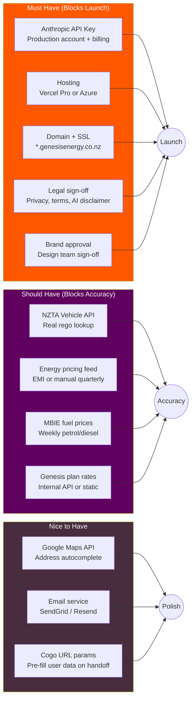

### Dependency Details

| # | Dependency | What's Needed | Who Provides | Lead Time | Fallback |
|---|-----------|--------------|-------------|-----------|----------|
| 1 | **Anthropic API key** | Production account with billing, Claude Sonnet 4 access | Genesis IT / Engineering | 1–2 days | Demo mode (keyword-matched responses, already built in POC) |
| 2 | **Hosting platform** | Vercel Pro or Azure App Service — needs Genesis IT approval | Genesis IT / Platform | 1–2 weeks | Vercel free tier for staging, Azure as alternate |
| 3 | **Domain + SSL** | Subdomain on genesisenergy.co.nz (e.g. `calculator.genesisenergy.co.nz`) | Genesis IT / DNS | 1 week | Deploy on Vercel default domain for UAT |
| 4 | **Legal review** | Privacy policy, terms of use, AI disclaimer copy approved | Genesis Legal | 1–2 weeks | Draft copy for staging, final copy before go-live |
| 5 | **Brand approval** | Design team confirms Brand 4.0 execution is production-quality | Genesis Brand / Design | 1 week | Already using Brand 4.0 tokens — risk is low |
| 6 | **NZTA Vehicle API** | API access registration, understand rate limits and data fields | Waka Kotahi / NZTA | 1–3 weeks | Manual vehicle type selection (already in POC) |
| 7 | **Energy pricing data** | Current regional electricity/gas rates from EMI or Powerswitch | Electricity Authority / EMI | 2–4 weeks if API; 1 day if manual | Hardcoded rates with "as of Q2 2026" disclaimer |
| 8 | **MBIE fuel prices** | Weekly petrol/diesel prices by region | MBIE (public data) | 1 day (publicly available) | Hardcoded with date stamp |
| 9 | **Genesis plan details** | Plan names, pricing, eligibility, feature descriptions | Genesis Product / Marketing | 1–2 weeks | Generic "contact Genesis" CTAs instead of specific plan recommendations |
| 10 | **Google Maps API** | API key with Places Autocomplete enabled, restricted to Genesis domains | Genesis IT / Google Cloud | 2–3 days | Manual region dropdown (already in POC) |
| 11 | **Email service** | SendGrid or Resend account for transactional email | Genesis IT / Marketing | 3–5 days | No email capture at launch (add later) |
| 12 | **Cogo URL params** | Confirm whether Cogo supports pre-filling user data via URL parameters | Cogo Account Manager | 1 week (conversation) | Standard links without pre-fill |

---

## 12. Effort Summary

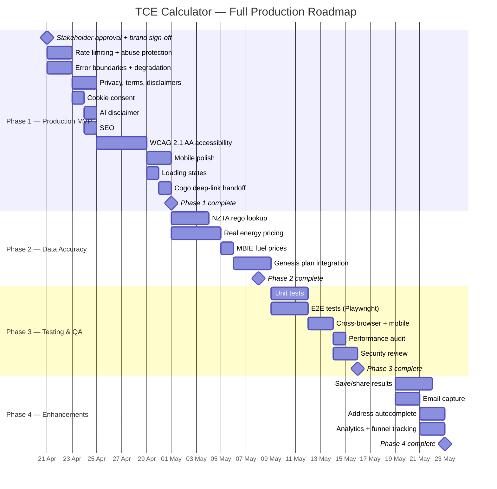

| Phase | Scope | Dev Effort | Calendar Time | Depends On |
|-------|-------|-----------|--------------|------------|
| **Phase 1** | Production MVP — security, compliance, accessibility, Cogo handoff, mobile polish | 16.5 days | 2 weeks | Stakeholder approval, brand sign-off |
| **Phase 2** | Data accuracy — real rego, energy pricing, fuel prices, Genesis plans | 11 days | 1.5 weeks | NZTA API access, Genesis product team |
| **Phase 3** | Testing & QA — unit, E2E, cross-browser, performance, security | 11 days | 1.5 weeks | Phase 1 + 2 complete |
| **Phase 4** | Enhancements — save/share, email capture, autocomplete, analytics | 9 days | 1 week | Phase 1 complete |
| | | | | |
| **Total** | | **47.5 dev days** | **6 weeks** (1 developer) | |

> Phases 2 and 4 can run in parallel. Critical path: Phase 1 → Phase 3 → Launch.
> With 2 developers, total calendar time compresses to **4 weeks**.

---

## 13. Cost Estimate

### Monthly Running Costs (Post-Launch)

| Item | Low | High | Notes |
|------|-----|------|-------|
| Hosting (Vercel Pro) | $20 | $50 | Scales with traffic |
| Anthropic Claude API | $150 | $500 | ~10k chat sessions/month at ~3 messages each |
| Rate limiting (Upstash Redis) | $10 | $25 | Per-IP throttling |
| Error monitoring (Sentry) | $0 | $26 | Free tier likely sufficient at launch |
| Analytics (GA4) | $0 | $0 | Free |
| Google Maps API | $0 | $50 | Only if address autocomplete added |
| Email service (Resend) | $0 | $20 | Only if email capture added |
| **Total** | **$180** | **$670** | |

### One-Off Costs

| Item | Estimate | Notes |
|------|----------|-------|
| Development (6 weeks, 1 developer) | Per resourcing model | Internal or contractor |
| Security review / pen test | $2,000–$5,000 | If Genesis IT requires external audit |
| Accessibility audit (external) | $3,000–$8,000 | If Genesis requires certified WCAG audit |

---

## 14. Decision Log

| # | Decision | Status | Owner |
|---|----------|--------|-------|
| 1 | TCE Calculator complements Cogo (not replaces) | **Proposed** | Product |
| 2 | Cogo handoff via deep-links (no API integration) | **Proposed** | Engineering |
| 3 | AI advisor uses Anthropic Claude (not Agentforce) | **Decided** (POC validated) | Engineering |
| 4 | All calculation runs client-side (no backend DB) | **Decided** (POC validated) | Engineering |
| 5 | Host on Vercel vs Azure | **Open** | IT/Platform |
| 6 | Energy pricing: live API vs manual quarterly update | **Open** | Product |
| 7 | Genesis plan integration: API vs static content | **Open** | Product/Platform |
| 8 | Cogo URL params for seamless handoff | **To investigate** | Engineering + Cogo AM |

---

## 15. Risk Register

| Risk | Likelihood | Impact | Mitigation |
|------|-----------|--------|------------|
| No clean API for NZ electricity/gas rates | High | Medium | Fall back to manual quarterly update from Powerswitch/MBIE. JSON config file is admin-friendly. |
| NZTA rego API has rate limits or missing fuel economy data | Medium | Medium | Supplement with RightCar/EECA vehicle database. Graceful fallback to manual entry. |
| Claude API costs spike with viral traffic | Medium | High | Rate limiting, per-session message caps, cache common questions, consider Haiku for simpler queries. |
| Savings estimates publicly challenged as inaccurate | Medium | High | Strong methodology section citing Rewiring Aotearoa + EECA. Same data sources as Cogo. Legal disclaimer. |
| Genesis IT blocks Vercel deployment | Low | High | Azure App Service as fallback. Engage IT early in Phase 1. |
| Cogo contract changes or ends | Low | Medium | Handoff is just deep-links — easy to replace with direct installer partnerships or remove. |
| Legal blocks AI advisor feature | Low | High | AI already has disclaimer + guardrails. Offer legal a demo. Worst case: launch without AI, add later. |
| Accessibility audit reveals major rework | Low | Medium | POC uses shadcn/ui (built on Radix — accessible primitives). Likely fixes not rewrites. |
