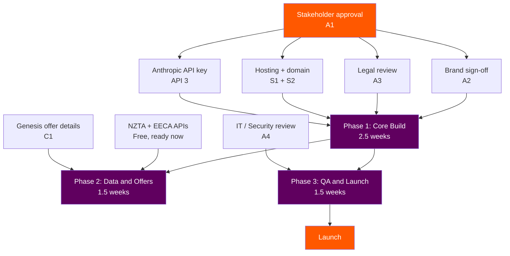
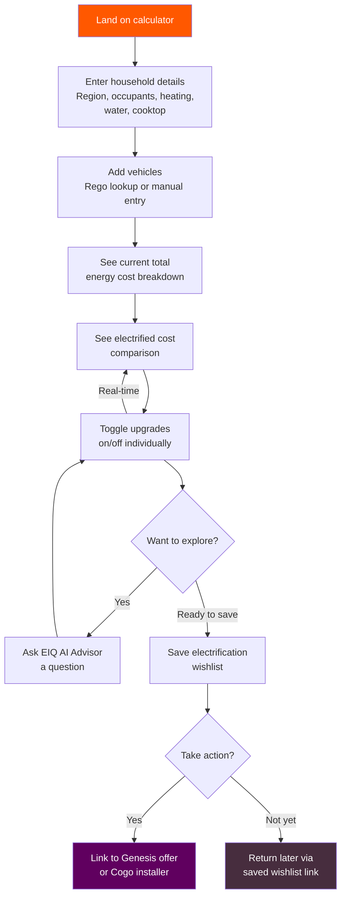
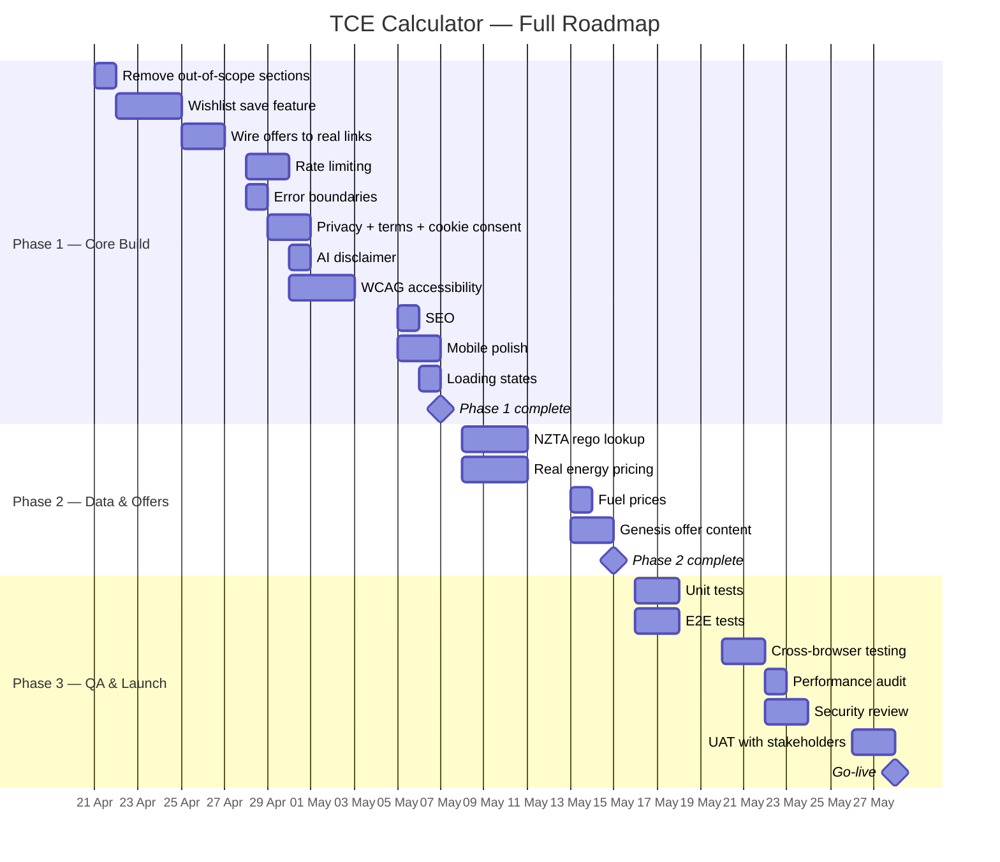

# Total Energy Cost Calculator — Scope & Estimate

**Date:** 14 April 2026
**Prepared for:** Bridget (via BHL)
**Status:** Draft for review

---

## 1. What We're Building

A Genesis-owned Total Energy Cost Calculator that shows NZ households the true cost of their energy across electricity, gas, and petrol — and what they'd save by going electric.

The tool lets customers enter their household energy profile (or look up their vehicle via rego), see their current total energy cost, then toggle electrification options on and off to see the impact in real-time. They can save an electrification wishlist and connect to Genesis offers for each upgrade.

This complements the existing Cogo Go Electric calculator — Cogo handles the installer marketplace and purchase journey; the TCE Calculator handles awareness, education, and the AI-powered conversation that no competitor has.

### What's In Scope

Per BHL's brief:

1. **Total cost of energy inputs** — region, household size, heating type, water heating, cooktop, vehicles
2. **Vehicle rego lookup** — seamless data capture via NZTA, with manual entry as fallback
3. **EIQ / AI Energy Advisor** — conversational AI grounded in the customer's specific energy data
4. **Current total energy cost output** — breakdown across electricity, gas, and petrol with stacked bar chart
5. **Electrified cost output** — what the same household would cost fully electric
6. **Electrification toggles** — independently toggle heating, hot water, cooking, transport, and solar on/off with real-time cost recalculation
7. **Save an electrification wishlist** — customers save their chosen upgrades and return to them later
8. **Link to Genesis offers** — each toggle/upgrade links to relevant Genesis offers and products

### What's Out of Scope

Per BHL — contain it to total cost of energy. The following POC features will be **removed** from the production build:

| POC Feature | What It Does | Why It's Out | Status |
|-------------|-------------|-------------|--------|
| **Household Cost Dashboard** | Spending breakdown across 8 categories (groceries, mortgage, rates, insurance, transport, comms, healthcare, energy) with donut chart and 12-month trend | BHL: "No need for wider household expenses" | Remove |
| **Savings Playbook** | 40+ cost-cutting ideas across 11 lifestyle categories (energy, groceries, insurance, rates, etc.) with tabbed browser | Out of scope — household expenses not included | Remove |
| **Receipt Scanner** | Photo upload → Claude Vision OCR → extracts merchant, amount, category, date | Only relevant to household expense tracking | Remove |
| **Total Cost View** | Full household spending context showing all categories together | Wider household expenses out of scope | Remove |
| **Spending Trend Chart** | 12-month spending trend across all categories | Wider household expenses out of scope | Remove |
| **Profile Switcher (Household)** | Switch between demo household spending profiles | Household dashboard feature | Remove |

**Also excluded (never in the POC):**
- Email capture / lead gen
- Open banking / bank feed integration
- User accounts or authentication

**Code removed:** `lib/household-model/`, `lib/cost-of-living/`, `/api/scan-receipt`, dashboard components, savings components — approximately 15 files and ~3,000 lines. Reduces bundle size and attack surface.

> These features are preserved in the POC codebase and can be brought back in a future phase if the scope expands.

---

## 2. What We Need

### Decisions Required

| # | Decision | Options | Needed By |
|---|----------|---------|-----------|
| D1 | **Where do we host this?** | Vercel Pro or Azure App Service | Before deployment |
| D2 | **What domain?** | e.g. `calculator.genesisenergy.co.nz` | Before deployment |
| D3 | **How do we keep energy pricing current?** | Manual quarterly JSON update (only option — no retail pricing API exists in NZ) | Before launch |
| D4 | **How does the wishlist save work?** | Browser-only (localStorage) or server-side (requires user identity) | Before Phase 1 build |
| D5 | **What Genesis offers should be linked?** | Specific product pages, Cogo flows, or both | Before Phase 2 build |

### Approvals Required

| # | Approval | Who | Lead Time |
|---|----------|-----|-----------|
| A1 | **Stakeholder green light** | Stephen England-Hall, Ed Hyde | 1 meeting |
| A2 | **Brand sign-off** | Genesis Brand / Design team | 1 week |
| A3 | **Legal review** | Genesis Legal — privacy policy, terms of use, AI disclaimer, savings disclaimer | 1–2 weeks |
| A4 | **IT / Security review** | Genesis IT / InfoSec — before going on a genesisenergy.co.nz subdomain | 1–2 weeks |

---

## 3. External APIs

We need 3 external APIs. Two are free and open, one is paid. There is no API for residential electricity/gas pricing in NZ — we handle that with a manual update process.

### API 1: NZTA Motor Vehicle Register — Rego Lookup

Looks up a NZ plate number and returns vehicle make, model, year, fuel type, and engine capacity.

| | |
|---|---|
| **Provider** | Waka Kotahi (NZTA) Open Data Portal |
| **Endpoint** | ArcGIS FeatureServer — query with `where=PLATE='ABC123'` |
| **Auth** | None — public open data |
| **Cost** | Free (Creative Commons licence) |
| **Format** | JSON |
| **Fields we use** | Plate, make, model, year, fuel type, CC rating, body type, motive power |
| **Update frequency** | Monthly snapshot of all registered NZ vehicles |
| **Rate limits** | ArcGIS standard (sufficient for our use case) |
| **Lead time** | **Ready now — no registration required** |
| **Link** | [NZTA Motor Vehicle Register API](https://opendata-nzta.opendata.arcgis.com/datasets/motor-vehicle-register-api) |

> **Limitation:** The MVR has fuel type but **not fuel economy** (L/100km). For fuel economy data we supplement with the EECA Fuelsaver API below.

### API 2: EECA Fuelsaver — Vehicle Fuel Economy

Looks up a plate or VIN and returns fuel economy (L/100km or kWh/100km for EVs), CO2 emissions, and energy star ratings. This fills the gap the NZTA data doesn't cover.

| | |
|---|---|
| **Provider** | EECA (Energy Efficiency and Conservation Authority) |
| **Endpoint** | `https://fuelsaver.govt.nz/api/?params={"api":"labels","plate":"ABC123","login":"[token]"}` |
| **Auth** | Login token — register at [resources.fuelsaver.govt.nz](https://resources.fuelsaver.govt.nz) |
| **Cost** | Free for commercial use |
| **Format** | JSON |
| **Fields we use** | Fuel economy (L/100km for petrol/diesel, kWh/100km for EVs), CO2 g/km, star ratings |
| **Query by** | Plate number, VIN, or model code |
| **Lead time** | **1–2 days** (register, receive token, test) |
| **Link** | [EECA Fuelsaver API](https://fuelsaver.govt.nz/api/) |

### API 3: Anthropic Claude — AI Advisor

Powers the EIQ AI Energy Advisor (streaming chat grounded in the user's energy data).

| | |
|---|---|
| **Provider** | Anthropic |
| **Endpoint** | `https://api.anthropic.com/v1/messages` |
| **Auth** | API key (server-side only, via `x-api-key` header) |
| **Cost** | Claude Sonnet 4: **$3/MTok input, $15/MTok output**. Estimated **$150–500/month** at ~10k chat sessions |
| **Format** | JSON + SSE streaming |
| **Model** | Claude Sonnet 4 (balanced cost/quality for conversational use) |
| **Rate limits** | Tier-based, scales with spend history. Default ~50 req/min — sufficient for launch |
| **Cost optimisation** | Prompt caching reduces repeated system prompt cost by ~90%. We should enable this since every chat session sends the same base system prompt. |
| **Lead time** | **1–2 days** — Genesis IT signs up at [console.anthropic.com](https://console.anthropic.com), adds billing, generates key |
| **Fallback** | POC demo mode works without an API key (keyword-matched responses, already built) |
| **Link** | [Anthropic API Pricing](https://platform.claude.com/docs/en/about-claude/pricing) |

### No API: Electricity & Gas Pricing

There is **no public API** for residential electricity or gas tariffs in New Zealand.

| What Exists | What It Covers | Why It Doesn't Work For Us |
|---|---|---|
| Electricity Authority EMI APIs | Wholesale spot prices, dispatch data | Wholesale only — not residential retail tariffs |
| Powerswitch | Residential plan comparison by region | No public API — consumer website only |
| EA Data & Insights Hub | Downloadable aggregate datasets | Aggregate data, not tariff-level pricing |

**Our approach:** Maintain a JSON config file (`/data/energy-pricing.json`) with regional residential rates sourced from Powerswitch published averages and MBIE quarterly energy statistics. Updated manually each quarter. Display "Pricing data as of [date]" on the results page. A non-developer at Genesis can update the file.

This is the same approach the Cogo Go Electric calculator uses — static regional averages, not live pricing.

### No API: Fuel Prices (CSV Download)

MBIE publishes weekly national average fuel prices as a free CSV download — not an API, but simple to consume.

| | |
|---|---|
| **Provider** | MBIE |
| **URL** | [weekly-table.csv](https://www.mbie.govt.nz/assets/Data-Files/Energy/Weekly-fuel-price-monitoring/weekly-table.csv) |
| **Cost** | Free (Creative Commons 4.0 NZ) |
| **Fields** | Regular petrol, premium petrol, diesel — board prices, adjusted retail, taxes, margins |
| **Regional** | National averages only (no regional breakdown) |
| **Update** | Weekly (previous week's data) |
| **Our approach** | Parse latest row from CSV into our pricing JSON config. Can be automated or updated manually. |
| **Link** | [MBIE Weekly Fuel Price Monitoring](https://www.mbie.govt.nz/building-and-energy/energy-and-natural-resources/energy-statistics-and-modelling/energy-statistics/weekly-fuel-price-monitoring) |

### API Summary

| # | API | Cost | Auth Required | Lead Time | Status |
|---|-----|------|--------------|-----------|--------|
| 1 | NZTA Motor Vehicle Register | Free | None | Ready now | Can start integrating |
| 2 | EECA Fuelsaver (fuel economy) | Free | Registration token | 1–2 days | Register at fuelsaver.govt.nz |
| 3 | Anthropic Claude | ~$150–500/mo | API key + billing | 1–2 days | Genesis IT sets up account |
| 4 | MBIE Fuel Prices | Free | None | Ready now | CSV download, parse weekly |
| 5 | Electricity/Gas pricing | N/A | N/A | N/A | **No API exists** — manual quarterly JSON |

**Total monthly API cost: ~$150–500** (Anthropic is the only paid API. Everything else is free.)

---

## 4. Accounts, Content & Critical Path

### Accounts & Access (Non-API)

| # | What | Who Sets It Up | Lead Time | Fallback If Delayed |
|---|------|---------------|-----------|-------------------|
| S1 | **Hosting account** (Vercel Pro or Azure) | Genesis IT | 1–2 weeks | Vercel free tier for UAT |
| S2 | **DNS entry** for subdomain | Genesis IT / Network | 1 week | Vercel default URL for UAT |
| S3 | **Analytics property** (GA4) | Genesis Marketing / Digital | 1–2 days | No analytics at launch |

### Content & Data

| # | What | Who Provides | Needed By | Fallback |
|---|------|-------------|-----------|----------|
| C1 | **Genesis offers to link to** — product pages, Cogo flows, pricing | Product / Marketing | Phase 2 | Generic "explore Genesis plans" CTA |
| C2 | **Privacy policy copy** (we draft, legal approves) | Legal | Before go-live | Draft copy on staging |
| C3 | **Terms of use copy** (we draft, legal approves) | Legal | Before go-live | Draft copy on staging |
| C4 | **Cogo deep-link URLs** — confirm correct URLs and whether URL params supported | Cogo Account Manager | Phase 2 | Known public URLs |

### Critical Path

---

## 5. What Already Exists (POC)

A working prototype has been built and validated. The majority of BHL's scope is already functional:

| Feature | POC Status | Production Work Needed |
|---------|-----------|----------------------|
| TCE form (all inputs) | Complete | Minor polish |
| Vehicle rego lookup | Complete (mocked data) | Integrate real NZTA API |
| EIQ / AI advisor | Complete (Claude streaming) | Rate limiting, disclaimer, fallback handling |
| Manual data capture fallback | Complete | None |
| Current cost summary (stacked bar) | Complete | None |
| Electrified cost summary | Complete | None |
| Electrification toggles (all 5) | Complete, real-time recalc | None |
| Solar toggle + cost impact | Complete | None |
| Save electrification wishlist | **Not built** | New feature — build from scratch |
| Link to Genesis offers | UI exists, links not wired | Wire to real URLs, confirm offers with marketing |

**Bottom line:** ~85% of the feature scope is built. The main new work is the wishlist save feature, wiring up offers, and production hardening.

---

## 6. User Flow

---

## 7. Detailed Scope — Phase 1: Core Build

**Goal:** Production-harden the existing POC and build the two missing features (wishlist + offers wiring). Strip out the out-of-scope sections (household dashboard, savings playbook, receipt scanner).

**Elapsed time:** 2.5 weeks (1 developer)

### 1.1 Remove Out-of-Scope Sections
**Estimate:** 1 day

Remove the household cost dashboard, savings playbook, receipt scanner, and total cost view from the application. These were valuable for the POC demonstration but are out of scope per BHL's brief. Clean removal — no dead code left behind.

**What gets removed:**
- Household cost dashboard (spending donut, trend chart, category cards)
- Savings playbook (40+ ideas across 11 categories)
- Receipt scanner (photo upload + Claude Vision OCR)
- Total cost view (wider household spending context)
- Related API route (`/api/scan-receipt`)
- Household model library (`lib/household-model/`, `lib/cost-of-living/`)

**What stays:**
- TCE form + calculation engine
- Results section (stacked bar, toggles, roadmap)
- AI conversation panel (EIQ)
- Power Circle offers section
- Shareable summary card

**Acceptance criteria:**
- Application loads with only in-scope features
- No dead imports, unused components, or orphaned routes
- Bundle size reduced

---

### 1.2 Electrification Wishlist — Save Feature
**Estimate:** 3 days | **Priority:** Must have (new feature per BHL)

Customers toggle electrification items on/off to build their preferred upgrade path. They need to be able to save that selection and return to it later. This is the "electrification wishlist" BHL described.

**What gets built:**

**Option A — Browser-based (recommended for MVP):**
- Save wishlist state to a shareable URL. Form inputs + toggle selections encoded as URL query parameters. Clicking "Save my wishlist" copies a link the customer can bookmark, share, or return to.
- Loading the URL restores the exact form state and toggle selections, recalculates results.
- "Save as image" option — branded PNG summary card showing selected upgrades, costs, and savings (existing `html-to-image` capability extended).
- PDF export option — one-page branded summary with wishlist items, estimated costs, savings, and Genesis offer links.

**Option B — Server-side persistence (future, if accounts exist):**
- Would require user identity (email or Genesis account login). Out of scope for MVP but the URL-based approach provides a clean migration path.

**Wishlist contents saved:**
- Household profile (region, occupants, appliance types, vehicles)
- Toggle selections (which electrification items are on/off)
- Calculated results (current cost, electrified cost, savings)
- Roadmap items with estimated costs and payback periods

**UI:**
- "Save my wishlist" button in the results section
- Modal/panel showing: shareable link (copy to clipboard), download as PDF, download as image
- When loading from a saved link: banner at top saying "Your saved electrification wishlist" with option to modify and re-save

**Acceptance criteria:**
- Saved URL reproduces exact form state and toggle selections
- URL is short enough for messaging apps (under 500 characters)
- PDF contains all wishlist items with costs, savings, and Genesis offer links
- No PII in the URL (only energy profile choices, not names or addresses)
- Works across devices (save on desktop, open on mobile)

---

### 1.3 Wire Offers to Real Genesis / Cogo Links
**Estimate:** 2 days | **Priority:** Must have (per BHL)

The POC has a Power Circle offers section that shows contextual offer cards based on the user's roadmap (e.g. if they toggle "heating" on, they see a Genesis heat pump offer). The buttons exist but aren't linked to real destinations.

**What gets built:**
- Wire each offer card CTA to the correct destination URL:
  - Heat pump → Genesis heat pump offer page _or_ Cogo heating installer flow
  - Hot water → Genesis hot water offer page _or_ Cogo hot water flow
  - Cooktop/induction → Genesis induction offer page
  - EV → Genesis EnergyEV plan page _or_ Cogo vehicle flow
  - Solar → Genesis solar page _or_ Cogo solar installer flow
- UTM parameters on all outbound links for tracking (`utm_source=tce-calculator&utm_medium=wishlist&utm_content=heat-pump`)
- Links open in new tab with `rel="noopener"`
- Offer cards only show for toggled-on items (existing behaviour, verify it works correctly)
- "Explore all Genesis offers" fallback link at bottom of section

**Acceptance criteria:**
- Every offer card CTA links to a real, working URL
- Links are trackable via UTM parameters
- Only relevant offers shown (matches user's toggled selections)
- Offers section is empty/hidden if user has no electrification items toggled on

**Dependency:** Genesis marketing/product team confirms which URLs to link to (C1). If not available, link to generic Genesis plans page as interim.

---

### 1.4 Rate Limiting on API Routes
**Estimate:** 2 days | **Priority:** Must have

The `/api/chat` endpoint calls the Anthropic Claude API on every message. On a public-facing site, this needs throttling to prevent abuse and cost blowout.

**What gets built:**
- Upstash Redis (or Vercel KV) integration for request counting
- Per-IP sliding window rate limits: 20 chat messages per hour per IP
- HTTP 429 response with `Retry-After` header when limit exceeded
- Client-side feedback when rate limited ("You've asked a lot of questions — please try again shortly")
- Redis connection failure degrades gracefully (requests allowed through, error logged)

**Acceptance criteria:**
- A single IP cannot exceed 20 chat requests/hour
- Rate-limited users see a friendly message, not a raw error
- Normal usage (3–5 questions per session) is never throttled
- If Redis is down, the app still works (just unthrottled)

---

### 1.5 Error Boundaries & Fallback States
**Estimate:** 1 day | **Priority:** Must have

Production needs to handle Claude API outages, slow responses, and JavaScript errors gracefully.

**What gets built:**
- React Error Boundaries wrapping the calculator, results, and EIQ panel independently
- Claude API timeout (30s) + single retry + fallback message
- If Claude is unavailable: calculator and results still work (client-side). EIQ shows "AI advisor is temporarily unavailable" with static FAQ-style conversation starters
- Structured error responses on all API routes

**Acceptance criteria:**
- Claude outage does not affect calculator or results
- EIQ panel shows clear fallback when Claude is unavailable
- No white-screen crashes reach the user

---

### 1.6 Privacy Policy & Terms of Use Pages
**Estimate:** 1 day | **Priority:** Must have (legal blocker)

**What gets built:**
- `/privacy` page — what data is collected (analytics cookies only, AI conversation content sent to Anthropic for processing but not stored, no PII persisted)
- `/terms` page — savings estimates are indicative, based on publicly available data, not a guarantee. Not financial advice. Methodology references (Rewiring Aotearoa, EECA, Powerswitch)
- Inline disclaimer on results page: "These estimates are based on average usage patterns and publicly available pricing. Your actual savings will depend on your circumstances."
- Footer links on every page

**Acceptance criteria:**
- Genesis legal has reviewed and approved all copy
- Disclaimers visible before users act on savings estimates

**Dependency:** We draft the content, Genesis legal approves/amends (A3).

---

### 1.7 Cookie Consent Banner
**Estimate:** 1 day | **Priority:** Must have (NZ Privacy Act)

**What gets built:**
- Cookie consent banner (bottom of viewport, non-blocking)
- Accept / Reject non-essential / Manage preferences
- Analytics scripts only load after consent granted
- Consent stored in localStorage, persists across sessions

**Acceptance criteria:**
- No analytics cookies set before user consents
- Banner appears on first visit, persists choice thereafter

---

### 1.8 AI Advisor Disclaimer
**Estimate:** 0.5 days | **Priority:** Must have

**What gets built:**
- Persistent label in the EIQ panel: "AI Energy Advisor — powered by AI. Responses are generated and may not be perfectly accurate."
- AI directed to refer users to Genesis for specific plan pricing rather than inventing details

**Acceptance criteria:**
- Users cannot interact with the AI without seeing the disclosure
- AI does not fabricate Genesis plan names or prices

---

### 1.9 WCAG 2.1 AA Accessibility Audit & Fixes
**Estimate:** 3 days | **Priority:** Must have

**What gets built:**
- Full audit using axe-core, Lighthouse, and manual keyboard/screen reader testing
- Fix all Level A and AA violations: keyboard navigation, focus management, screen reader labels, colour contrast (4.5:1 body, 3:1 large text), chart text alternatives, form error association
- Skip-to-content link, landmark regions
- Respect `prefers-reduced-motion`

**Acceptance criteria:**
- Zero axe-core violations at AA level
- Full flow completable via keyboard only
- VoiceOver (macOS) / TalkBack (Android) can navigate all content
- Lighthouse Accessibility score 95+

---

### 1.10 SEO
**Estimate:** 1 day | **Priority:** Should have

**What gets built:**
- Page title, meta description, canonical URL
- Open Graph + Twitter Card tags with branded preview image
- JSON-LD structured data (WebApplication)
- robots.txt, sitemap.xml, favicon

**Acceptance criteria:**
- Social media sharing shows branded preview card
- Lighthouse SEO score 90+

---

### 1.11 Mobile Responsive Polish
**Estimate:** 2 days | **Priority:** Should have

**What gets built:**
- Test and fix on iPhone SE, iPhone 15, Samsung Galaxy, iPad Mini
- Touch targets minimum 44x44px
- Form inputs >= 16px (no iOS zoom)
- Charts readable at 320px viewport
- EIQ panel as full-screen overlay on mobile
- No horizontal scroll on any viewport

**Acceptance criteria:**
- No layout issues on any device 320px+
- All interactive elements meet 44x44px touch target minimum
- Charts readable and interactive on mobile

---

### 1.12 Loading States
**Estimate:** 0.5 days | **Priority:** Should have

**What gets built:**
- Skeleton loading for results section (prevents layout shift)
- Typing indicator in EIQ panel while waiting for Claude
- Smooth scroll to results after form submission

**Acceptance criteria:**
- No layout shift when results appear
- Typing indicator shows within 200ms of sending a message

---

## 8. Detailed Scope — Phase 2: Data & Offers

**Goal:** Replace mocked data with real sources and wire up Genesis offers.

**Elapsed time:** 1.5 weeks (1 developer)

### 2.1 NZTA Vehicle Register — Real Rego Lookup
**Estimate:** 3 days | **Priority:** Must have

Replace the mocked rego lookup with the real NZTA Motor Vehicle Register API. Extract make, model, year, and fuel type. Estimate fuel economy from engine capacity + vehicle class using RightCar/EECA data where NZTA doesn't provide it directly. Cache lookups for 24 hours. Graceful fallback to manual entry if API unavailable.

**Acceptance criteria:**
- Valid NZ plates return correct vehicle fuel type
- Not-found plates fall back to manual selection seamlessly
- NZTA being slow/down doesn't block the form

**Dependency:** NZTA API access (S4). Can build against mock while waiting.

---

### 2.2 Real Electricity & Gas Pricing
**Estimate:** 3 days | **Priority:** Must have

Replace hardcoded rates with a maintainable JSON config file (`/data/energy-pricing.json`) containing regional electricity rates, gas rates, and fixed charges. Updated quarterly from Powerswitch/EMI data. Includes `lastUpdated` timestamp shown to users. Admin-friendly format — a non-developer can update it.

**Acceptance criteria:**
- Pricing updatable by editing a single JSON file
- Results page shows "Pricing data as of [date]"
- Regional differences reflected accurately

---

### 2.3 MBIE Fuel Prices
**Estimate:** 1 day | **Priority:** Should have

Add petrol/diesel to the pricing config. MBIE publishes weekly fuel monitoring data. Updated weekly or fortnightly.

**Acceptance criteria:**
- Fuel prices not older than 4 weeks at any time
- Source and date visible to users

---

### 2.4 Genesis Plan & Offer Content
**Estimate:** 2 days | **Priority:** Should have

Populate the offers section with real Genesis product content. Static content cards based on a JSON config — plan name, description, CTA text, destination URL, eligibility rule (e.g. "show if user has toggled EV").

**Acceptance criteria:**
- Relevant offers shown based on user's toggled selections
- All CTAs link to real, working Genesis/Cogo URLs
- Content maintainable via JSON config without code changes

**Dependency:** Genesis marketing/product provides offer details (C1).

---

## 9. Detailed Scope — Phase 3: QA & Launch Prep

**Goal:** Verify everything works, is secure, and passes Genesis IT review.

**Elapsed time:** 1.5 weeks (1 developer)

### 3.1 Unit Tests — Energy Model
**Estimate:** 2 days | **Priority:** Must have

Test suite covering `calculateTCE()` and all sub-functions. Verify all 3 demo profiles produce correct outputs. Edge cases: 1 occupant, no vehicles, already-electric household, all-gas household. Regression guard for pricing constant changes.

**Acceptance criteria:**
- 100% function coverage on `lib/energy-model/`
- Demo profiles within 5% of manually verified expected values
- Tests run in CI on every commit

---

### 3.2 E2E Tests — Playwright
**Estimate:** 2 days | **Priority:** Must have

Automated browser tests: happy path (fill form → results → toggle → wishlist save → offer link), demo profile quick-fill, form validation, mobile viewport, EIQ fallback state, rate limit handling.

**Acceptance criteria:**
- All tests pass in CI
- Desktop (1280px) and mobile (375px) viewports
- Tests complete under 2 minutes

---

### 3.3 Cross-Browser & Mobile Testing
**Estimate:** 2 days | **Priority:** Should have

Manual testing on Chrome, Safari, Firefox, Edge (desktop), Safari iOS, Chrome Android. Verify: form, results, charts, toggles, wishlist save, EIQ, offer links.

**Acceptance criteria:**
- No broken layouts or missing functionality on tested browsers
- All issues fixed before launch

---

### 3.4 Performance Audit
**Estimate:** 1 day | **Priority:** Should have

Lighthouse audit. Core Web Vitals: LCP < 2.5s, FID < 100ms, CLS < 0.1. Bundle size analysis. Font loading. Image optimisation.

**Acceptance criteria:**
- Lighthouse Performance 90+ desktop, 80+ mobile
- Total JS bundle < 300KB gzipped

---

### 3.5 Security Review
**Estimate:** 2 days | **Priority:** Must have

API input validation, rate limiting verification, CORS (Genesis domains only), CSP headers, dependency audit (`npm audit`), no exposed secrets, HTTP security headers, AI prompt injection review.

**Acceptance criteria:**
- Zero high/critical vulnerabilities
- CSP headers configured
- Genesis IT sign-off (A4)

---

### 3.6 UAT with Stakeholders
**Estimate:** 2 days | **Priority:** Must have

Deploy to staging URL. Walk through with BHL and stakeholders. Collect feedback. Fix critical issues. Final sign-off for go-live.

**Acceptance criteria:**
- Stakeholders have tested all features on staging
- All critical feedback addressed
- Go-live approval received

---

## 10. Effort Summary

| Phase | Scope | Dev Days | Calendar |
|-------|-------|---------|----------|
| **Phase 1 — Core Build** | Strip out-of-scope, build wishlist, wire offers, production harden (security, compliance, accessibility, mobile) | 18 days | 2.5 weeks |
| **Phase 2 — Data & Offers** | Real rego lookup, energy pricing, fuel prices, Genesis offer content | 9 days | 1.5 weeks |
| **Phase 3 — QA & Launch** | Unit tests, E2E tests, cross-browser, performance, security, UAT | 11 days | 2 weeks |
| **Total** | | **38 dev days** | **~6 weeks** (1 developer) |

> With 2 developers, Phases 1 and 2 can overlap — total compresses to **~4 weeks**.

---

## 11. Monthly Running Costs (Post-Launch)

| Item | Low | High | Notes |
|------|-----|------|-------|
| Hosting (Vercel Pro) | $20 | $50 | Scales with traffic |
| Anthropic Claude API | $150 | $500 | ~10k chat sessions/month |
| Rate limiting (Upstash) | $10 | $25 | Per-IP throttling |
| Error monitoring (Sentry) | $0 | $26 | Free tier likely sufficient |
| Analytics (GA4) | $0 | $0 | Free |
| **Total** | **$180** | **$600/month** | |

---

## 12. Risks

| Risk | Likelihood | Impact | Mitigation |
|------|-----------|--------|------------|
| Electricity/gas pricing goes stale between quarterly updates | Medium | Medium | Show "as of [date]" on results. Same approach Cogo uses. |
| NZTA or EECA API has rate limits or downtime | Low | Medium | Both are free public APIs. Graceful fallback to manual vehicle entry (already built). Cache lookups for 24hrs. |
| Claude API costs spike with traffic | Medium | High | Rate limiting, per-session caps, shorter system prompts |
| Savings estimates publicly challenged | Medium | High | Strong methodology section + disclaimers. Same data sources as Cogo (Rewiring Aotearoa) |
| Genesis IT blocks Vercel | Low | High | Azure App Service as fallback |
| Legal delays on privacy/terms copy | Medium | Medium | Deploy to staging with draft copy. Final copy before go-live only |
| Genesis offer URLs not confirmed in time | Medium | Low | Generic "explore Genesis plans" link as interim |

---

## 13. Decision Log

| # | Decision | Status | Owner |
|---|----------|--------|-------|
| 1 | Scope limited to TCE inputs/outputs — no household expenses | **Decided** (BHL) | BHL |
| 2 | TCE Calculator complements Cogo (not replaces) | **Decided** | BHL / Product |
| 3 | Wishlist saves via URL + PDF (no user accounts) | **Proposed** | Engineering |
| 4 | AI advisor uses Anthropic Claude | **Decided** (POC validated) | Engineering |
| 5 | All calculation runs client-side | **Decided** (POC validated) | Engineering |
| 6 | Host on Vercel vs Azure | **Open** | IT |
| 7 | Energy pricing: manual quarterly JSON update (no NZ retail pricing API exists) | **Decided** (no alternative) | Engineering |
| 8 | Which Genesis offers to link to | **Open** | Marketing / Product |
